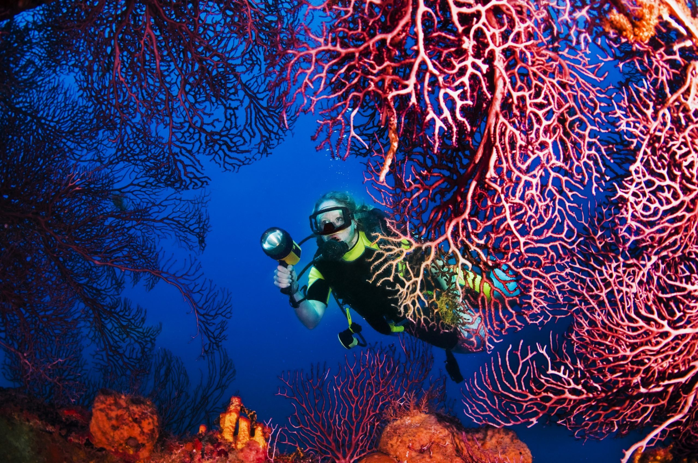

# OceanVision: Real-Time Underwater Object Detection

A computer vision project to detect and classify underwater objects in real time using deep learning techniques.

## Motivation

With increasing interest in marine research, underwater exploration, and environmental monitoring, the ability to accurately detect and classify underwater objects such as marine animals, plants, and debris is crucial. This project aims to develop a robust real-time detection system to aid scientists, conservationists, and underwater vehicle operators.

## Overview

OceanVision leverages convolutional neural networks (CNNs) to process underwater video feeds and identify objects of interest. Using a custom-labeled dataset, the model is trained to recognize multiple classes of underwater entities, enabling applications from habitat mapping to pollution tracking.

## Dataset

- A custom dataset of annotated underwater images and videos collected from various marine environments.  
- Contains over 10,000 labeled samples spanning 10 object classes including fish species, coral types, and man-made debris.

## Methodology

- **Data Collection & Annotation:** Compiled underwater footage; manually labeled object bounding boxes.  
- **Preprocessing:** Applied image enhancement techniques to address low visibility and color distortion underwater.  
- **Model Architecture:** Used YOLOv5 for its balance of speed and accuracy in object detection.  
- **Training:** Fine-tuned the model on the underwater dataset with data augmentation to improve robustness.  
- **Evaluation:** Assessed performance using mAP (mean Average Precision), precision, recall, and inference time metrics.

## Results

| Metric    | Value    |
|-----------|----------|
| mAP@0.5   | 78.5%    |
| Precision | 81.2%    |
| Recall    | 76.4%    |
| FPS       | 24       |

The model achieves near real-time detection speeds with strong accuracy across multiple classes.

## Future Work

- Expand dataset with more diverse underwater conditions and species.  
- Optimize model for deployment on embedded underwater devices.  
- Integrate with autonomous underwater vehicles (AUVs) for live monitoring.
